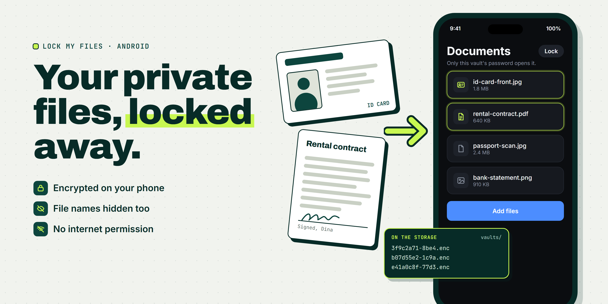

# Lock My Files

**Keep your ID cards, contracts and private photos out of the gallery, locked behind a password only you know.**

Source is not public yet. The APK is free to use.

**[Download the Android app (APK)](https://github.com/BrianArfi/lock-my-files/releases/latest)**

**Early build, not yet tested on a real phone. Keep a copy of anything important elsewhere.**

## Why

Your ID scans, contracts and private photos sit in the gallery and the cloud, next to holiday pictures. Anyone who holds your phone, or any app with access to your files, can see them. A "hidden" folder behind a PIN screen does not change that: the files are still readable. Lock My Files makes them unreadable without your password.

## What it does

- **Locks files in a vault.** Each vault has its own password, and each file is encrypted on the way in.
- **Hides the file names too.** `passport-scan.jpg` is not readable on the storage.
- **v0.1.0 has no internet permission**, so Android does not let it connect. Check it in App info, Permissions.
- **Opens files inside the app.** Photos, text, video and audio open in the vault, without another app.
- **Gives you 12 recovery words per vault**, for the day you forget the password.

## Quick start

1. On your phone, download `lock-my-files-0.1.0.apk` from the [latest release](https://github.com/BrianArfi/lock-my-files/releases/latest).
2. Allow "Install unknown apps" for your browser when Android asks.
3. Optional: check the SHA-256 on a computer (command in [docs/install.md](docs/install.md#steps)).
4. Set a six-digit app passcode, make a vault, write down its 12 recovery words, and add your first file.

## Example

| Before | After |
| :--- | :--- |
| A passport scan in the camera roll, next to holiday photos | The scan in a vault called "Documents", encrypted, name included |
| Any app with storage access can read the file name | The file name is encrypted with the file |
| "Is this app uploading my files?" | v0.1.0 has no internet permission, so no upload is possible |

---

## Documentation

- [Install and verify](docs/install.md): requirements, SHA-256 check, first setup, and a test vault to try recovery.
- [How it works](docs/how-it-works.md): the flow from install to auto-lock, step by step.
- [Features](docs/features.md): every feature, what you get, and what to use it for.
- [Security and limits](docs/security.md): how the encryption works, and what the app does not do.

## Status

Version 0.1.0, Android only. The encryption is checked against published test vectors, and the whole flow passes an automated end-to-end test. That test has only run in an iOS simulator. This Android build has not been run on a real phone. Do not put anything in it that you cannot afford to lose.

This repository hosts the release download. The source code is not published here.

## FAQ

**What happens if I forget my password?**
Use the 12 recovery words for that vault. If you lost those too, the files are gone. There is no reset, because a reset would mean someone else could open your files.

**How do I know it does not upload my files?**
Version 0.1.0 has no internet permission, so Android does not let it open a network connection. Open the app info screen on your phone and check the permissions list.

**Is it safe to use for important files now?**
Not yet. Version 0.1.0 has not been run on a real Android phone. Keep a copy of anything important somewhere else until a tested build is out.

**Does it hide the original photo from my gallery?**
No. It copies the file into the vault. You delete the original yourself.

**Is there an iPhone version?**
Not in this repository. The download here is Android only.

More questions and every known limit: [Security and limits](docs/security.md).

## Changelog

The full history is in [CHANGELOG.md](CHANGELOG.md). **Latest: [0.1.0] - 2026-09-09**, the first public build. Each [release](https://github.com/BrianArfi/lock-my-files/releases) carries its own notes and the SHA-256 of its download.

## License

The contents of this repository are licensed under Apache-2.0: see [LICENSE](LICENSE) and [NOTICE](NOTICE). The APK in the releases is free to download. The app's source code is not published in this repository.

More AI skills: https://brianarfi.com/skills
