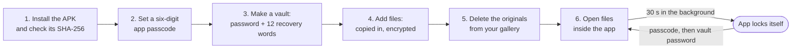

# Lock My Files

**A locked folder on your phone that only your password opens.**

Put photos, documents and videos into a vault. Each file is encrypted on the way in, and its name is encrypted too. The app cannot connect to the internet, and a file leaves the vault only when you save a copy out. Nobody can reset the password for you.

[](#license)
[](CHANGELOG.md)
[](#requirements)

**[Download the Android app (APK)](https://github.com/BrianArfi/lock-my-files/releases/latest)**

## Your phone holds more than it used to

Your phone now holds things that used to live in a locked drawer: ID scans, contracts, bank letters, private photos. At the same time, more and more apps ask to read your gallery and your files. A folder that is only hidden behind a PIN screen is not enough. The files have to be unreadable without your password.

| Feature | What it does | Example |
| :--- | :--- | :--- |
| Vaults | A locked folder with its own password. Make as many as you like | One vault for ID documents, one for private photos |
| Encrypted names | The file name is encrypted with the file, not left in a list | `divorce-papers.pdf` is not readable on the storage |
| Per-file password | One file gets a second, separate password | A will that stays shut even when the vault is open |
| Recovery words | 12 words per vault, shown once when you make it | You forget the vault password, and the words open it again |
| No internet permission | Android does not let the app open a network connection | Check it yourself in the app info screen |

## The gap

You have probably done at least one of these:

- Sent a passport scan to yourself in a chat, so it is "somewhere safe".
- Kept a contract in the camera roll, next to holiday photos.
- Handed your phone to a friend to show one photo, and hoped they did not swipe.
- Used a "hidden photos" app without knowing if it encrypts anything.

Most places on a phone are easy to open. Very few are really locked.

## The fix

Lock My Files makes a vault that is encrypted on the device, with a key that comes from your password. The app has no copy of your password and no way to check a guess other than doing the full, slow decryption. Files open inside the app, so you never hand them to another app just to look at them.

| Before | After |
| :--- | :--- |
| Private files mixed into the gallery | Private files in a vault, encrypted |
| File names readable by any app with storage access | File names encrypted with the file |
| One PIN for everything | An app passcode, plus a separate password per vault, plus an optional password per file |
| "Is this upload going somewhere?" | No internet permission, so no upload is possible |

## Who it is for

Anyone who keeps private files on an Android phone and wants them really locked, not only hidden: ID scans, financial papers, medical letters, personal photos. You do not need to know anything about encryption. You do need to keep your password and recovery words safe, because nobody can recover them for you.

## How it works



1. **Install and verify.** Download the APK from the release, and check it against the SHA-256 in the release notes before you install it. Example: `certutil -hashfile lock-my-files-0.1.0.apk SHA256`.
2. **Set the app passcode.** Six digits. This opens the app. You can also turn on fingerprint or face unlock in Settings, if the phone has it.
3. **Make a vault.** Give it a name and a password. Write down the 12 recovery words the app shows you. Example: a vault called "Documents".
4. **Add files.** Tap to add, pick one or more files, and the app copies them in, encrypted.
5. **Delete the originals.** Adding a file copies it. The original stays in your gallery or downloads until you delete it yourself.
6. **Open files inside the app.** Photos, text, video and audio open in the vault. When you switch away for 30 seconds, the app locks itself.

## What it can do

| Feature | What you get | Use it for |
| :--- | :--- | :--- |
| App passcode | A six-digit passcode in front of the whole app, with optional fingerprint or face unlock | Keeping the app itself shut when someone else holds the phone |
| Vaults | As many vaults as you like, each with its own password | Keeping work papers and personal photos apart |
| Recovery words | 12 words per vault that open it if you forget the password | A paper backup of the password, kept somewhere safe |
| Per-file password | A second password on one file. The vault password and the recovery words cannot open it | The one document that needs more than the vault |
| Encrypted file names | Names and file types are inside the encrypted data. File size and date are stored in the clear | Files whose name alone says too much |
| In-app viewer | Photos, text, video and audio open inside the app | Looking at a file without sharing it to another app |
| Save a copy out | Decrypts one file and hands it to the share sheet | Sending a document when you choose to |
| Auto-lock and screen protection | Locks 30 seconds after you switch away. Blocks screenshots and hides the app in the recent apps view | Leaving the phone on a table without worry |

## Quick start

**1. Download.** Open the [latest release](https://github.com/BrianArfi/lock-my-files/releases/latest) on your phone or computer. Get `lock-my-files-0.1.0.apk` and `lock-my-files-0.1.0.apk.sha256`.

**2. Verify the download.** Compare the result with the SHA-256 in the release notes:

```bash
shasum -a 256 lock-my-files-0.1.0.apk                # macOS or Linux
certutil -hashfile lock-my-files-0.1.0.apk SHA256    # Windows
```

If the two values are not the same, do not install the file.

**3. Install.** Copy the APK to the phone and open it. Android asks you to allow installs from that source. Allow it for this install only.

**4. Set up.** Set the six-digit app passcode, then make your first vault and write down its 12 recovery words.

### Try it first, with a test vault

Before you put real files in, make a vault called "Test" and add a file you do not need. Lock the app, then open the vault again with the password. Then open it with the 12 recovery words. When both work, you know how the recovery works. Delete the test vault after that.

## Security design, in short

- **Keys come from your password.** The vault password goes through Argon2id to make a key. That key unwraps the vault's master key. The recovery words are a second way to unwrap the same master key.
- **Files are encrypted with XChaCha20-Poly1305**, in 1 MiB chunks. Each file has its own key.
- **No password verifier is stored.** There is nothing on the phone to test a guess against. The only way to test a password is the full key derivation.
- **A per-file password replaces the vault key for that file.** So the vault password and the recovery words do not open it.
- **No backdoor key and no escrow.** Nobody, including the developer, can open a vault without the password or the recovery words.

## What it does not do

- **Nobody can reset your password.** There is no account, no email recovery and no support desk. Lose the password and the recovery words, and the files are gone permanently.
- **Nothing is backed up.** Lose the phone and the vaults go with it. A vault is not a backup.
- **The original file stays where it was.** Adding a file copies it. Delete the original yourself.
- **Video and audio write a temporary copy.** The player needs a real file, so a decrypted copy sits in the app's private storage while it plays. The app deletes it when you close the file, when the vault locks, and at every launch. Photos and text open in memory only.
- **The vault name is not encrypted.** The app has to list vaults before any of them is open. Use a plain name like "Documents".
- **File size and date are not encrypted.** Names and file types are inside the encrypted data. File size and date are stored in the clear.
- **Wrong guesses are not rate-limited in 0.1.0.** Nothing slows down repeated wrong guesses at the passcode or a vault password. Pick a vault password that is long and hard to guess.

## Status

Version 0.1.0, Android only. The encryption is checked against published test vectors, and the whole flow passes an automated end-to-end test. That test has only run in an iOS simulator. This Android build has not been run on a real phone. Do not put anything in it that you cannot afford to lose.

This repository hosts the release download. The source code is not published here.

## Requirements

- **Android 7 or later.**
- **A 64-bit or 32-bit ARM phone** (arm64-v8a or armeabi-v7a). Most Android phones are one of these.
- **Permission to install an APK** from outside the Play Store, for this one install.

## FAQ

**What happens if I forget my password?**
Use the 12 recovery words for that vault. If you lost those too, the files are gone. There is no reset, because a reset would mean someone else could open your files.

**How do I know it does not upload my files?**
The app has no internet permission, so Android does not let it open a network connection. Open the app info screen on your phone and check the permissions list.

**Is it safe to use for important files now?**
Not yet. Version 0.1.0 has not been run on a real Android phone. Keep a copy of anything important somewhere else until a tested build is out.

**Why is it an APK and not a store download?**
This build is published here, as an APK on the release page. Check the SHA-256 before you install it.

**Is there an iPhone version?**
Not in this repository. The download here is Android only.

**Does it hide the original photo from my gallery?**
No. It copies the file into the vault. You delete the original yourself.

## Changelog

The full history is in [CHANGELOG.md](CHANGELOG.md). **Latest: [0.1.0] - 2026-09-09**, the first public build: vaults with separate passwords, 12 recovery words per vault, per-file passwords, encrypted file names, and no internet permission. Each [release](https://github.com/BrianArfi/lock-my-files/releases) carries its own notes and the SHA-256 of its download.

## License

No open-source license. The APK in the releases is free to download. The source code is not published, and this repository grants no rights to it.
