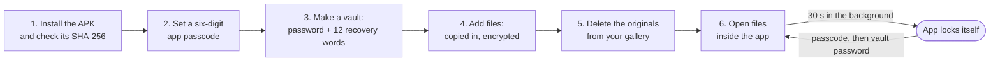

# How it works

[Back to the README](../README.md)

1. **Install and verify.** Download the APK from the release, and check it against the SHA-256 in the release notes before you install it. Example: `certutil -hashfile lock-my-files-0.1.0.apk SHA256`. Full steps: [Install and verify](install.md).
2. **Set the app passcode.** Six digits. This opens the app. You can also turn on fingerprint or face unlock in Settings, if the phone has it.
3. **Make a vault.** Give it a name and a password. Write down the 12 recovery words the app shows you. Example: a vault called "Documents".
4. **Add files.** Tap to add, pick one or more files, and the app copies them in, encrypted.
5. **Delete the originals.** Adding a file copies it. The original stays in your gallery or downloads until you delete it yourself.
6. **Open files inside the app.** Photos, text, video and audio open in the vault. When you switch away for 30 seconds, the app locks itself.

## The gap it closes

You have probably done at least one of these:

- Sent a passport scan to yourself in a chat, so it is "somewhere safe".
- Kept a contract in the camera roll, next to holiday photos.
- Handed your phone to a friend to show one photo, and hoped they did not swipe.
- Used a "hidden photos" app without knowing if it encrypts anything.

Lock My Files makes a vault that is encrypted on the device, with a key that comes from your password. The app has no copy of your password and no way to check a guess other than doing the full, slow decryption. Files open inside the app, so you never hand them to another app just to look at them.

| Before | After |
| :--- | :--- |
| Private files mixed into the gallery | Private files in a vault, encrypted |
| File names readable by any app with storage access | File names encrypted with the file |
| One PIN for everything | An app passcode, plus a separate password per vault, plus an optional password per file |
| "Is this upload going somewhere?" | No internet permission, so no upload is possible |

## Who it is for

Anyone who keeps private files on an Android phone and wants them really locked, not only hidden: ID scans, financial papers, medical letters, personal photos. You do not need to know anything about encryption. You do need to keep your password and recovery words safe, because nobody can recover them for you.
